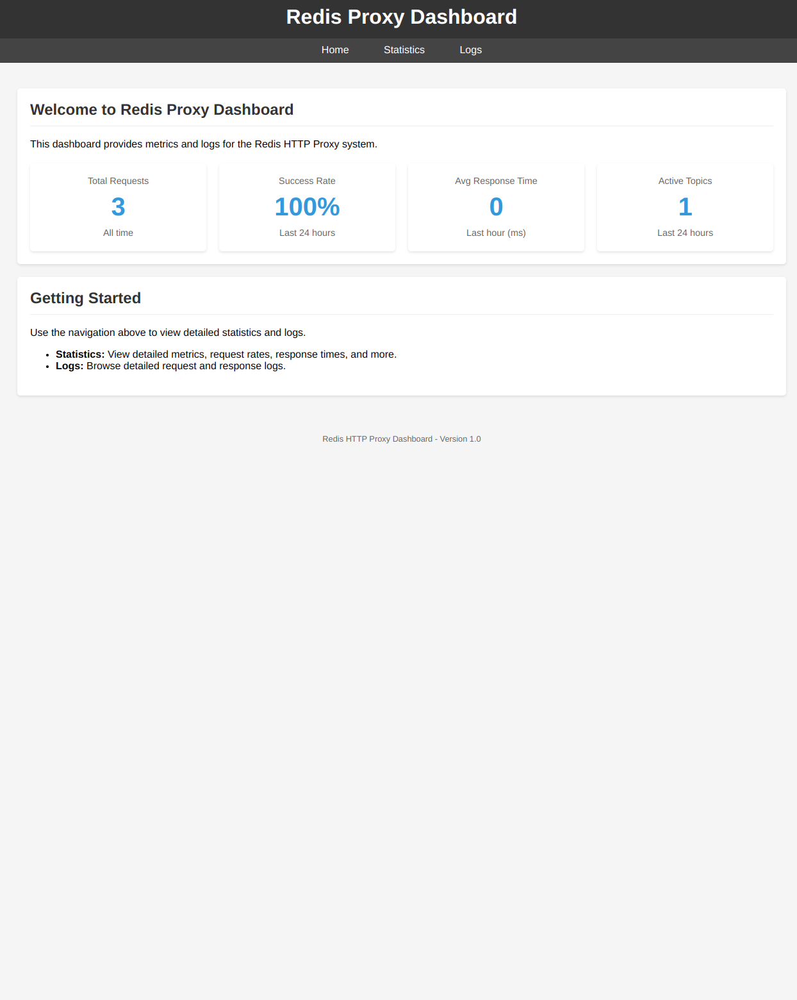
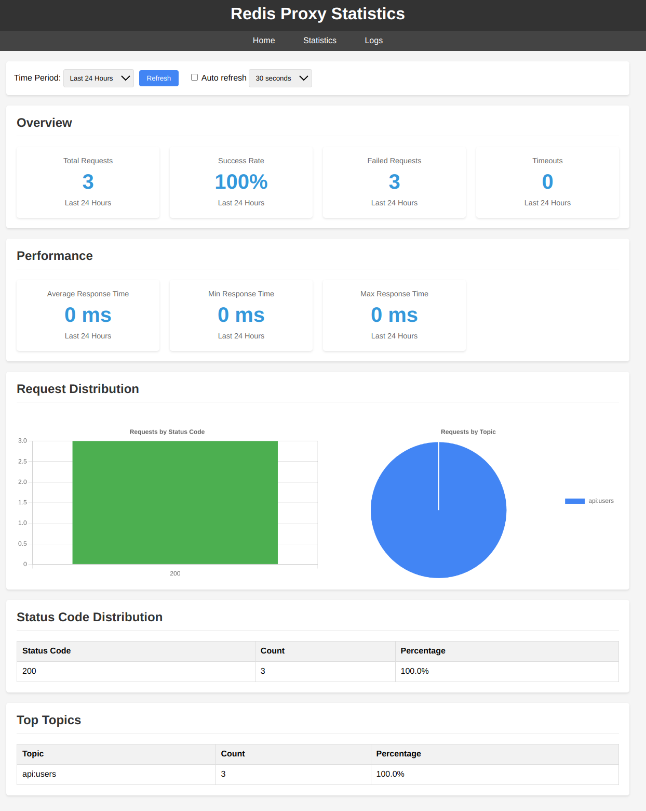
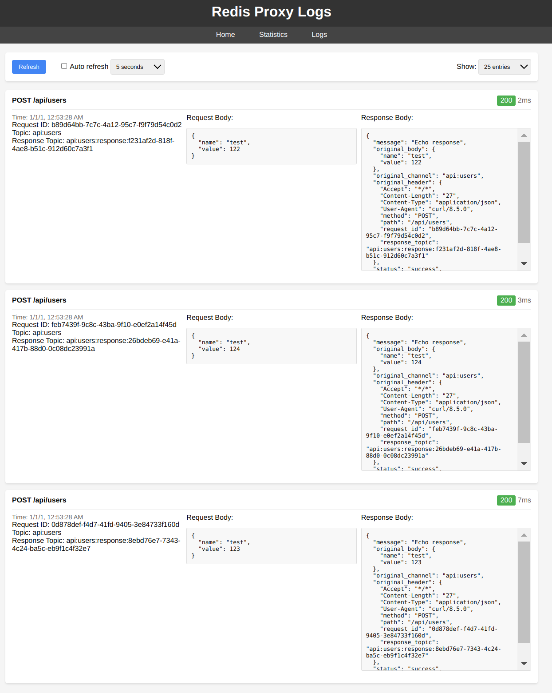

# Redis HTTP Proxy with Dashboard

A comprehensive HTTP-to-Redis communication system with integrated monitoring dashboard and flexible backend configuration options.

## System Architecture

This system consists of the following core components:

1. **HTTP Redis Proxy** - Serves as an HTTP bridge to Redis pub/sub messaging
2. **Dashboard Interface** - Provides real-time monitoring, logs, and statistics
3. **Redis Echo Server** - Backend service that listens on Redis topics and responds to messages
4. **Redis** - Message broker that connects all components

```
┌───────────┐      HTTP      ┌───────────────┐
│  Client   │◄──────────────►│  Redis HTTP   │
│  Browser  │                │  Proxy        │◄─────┐
└───────────┘                └───────────────┘      │
                                     │               │
                                     │ Redis Pub/Sub │
                                     ▼               │
                              ┌──────────────┐       │ HTTP
                              │  Redis       │       │ Dashboard
                              │  Broker      │       │ Interface
                              └──────────────┘       │
                                     │               │
                                     │ Redis Pub/Sub │
                                     ▼               │
                              ┌──────────────┐       │
                              │  Echo Server │       │
                              │  Backend     │◄──────┘
                              └──────────────┘
```

## Dashboard Screenshots

<div style="display: flex; justify-content: space-between; gap: 10px;">
  <div style="flex: 1; text-align: center;">
    
    <p><strong>Dashboard Overview</strong></p>
  </div>
  <div style="flex: 1; text-align: center;">
    
    <p><strong>Statistics View</strong></p>
  </div>
  <div style="flex: 1; text-align: center;">
    
    <p><strong>Logs View</strong></p>
  </div>
</div>


## Features

### HTTP Redis Proxy
- **Flexible Routing**:
  - Path-based topic routing (converts URL paths to Redis topics)
  - Fixed topic support (all requests go to a single topic)
- **Multiple Operation Modes**:
  - Synchronous (waits for response)
  - Asynchronous/Fire-and-forget (immediate response)
- **Robust Error Handling**:
  - Race-condition safe subscription management
  - Configurable timeouts
  - Detailed error reporting
- **Performance Optimizations**:
  - Connection pooling
  - Efficient subscription handling

### Dashboard Interface
- **Real-time Monitoring**:
  - Overview dashboard with key metrics
  - Auto-refreshing statistics
  - Time period filtering (hour, day, week, month, all-time)
- **Detailed Log Viewing**:
  - Full request/response inspection
  - Request body visualization
  - Response timing analysis
  - Error highlighting
- **Statistical Analysis**:
  - Request distribution by status code
  - Topic popularity metrics
  - Response time analysis
  - Success/failure rate tracking

### Echo Server
- **Flexible Topic Subscriptions**:
  - Single topic mode
  - Multi-topic mode
  - Pattern-based/wildcard subscriptions
- **Testing Capabilities**:
  - Configurable response delays
  - Debug logging
  - Customizable response format
- **Request Inspection**:
  - Preserves original request headers and path
  - Maintains original request body

## Getting Started

### Prerequisites

- Go 1.19 or higher
- Redis 5.0 or higher
- SQLite (for logging)

### Installation

#### Using Docker Compose (Recommended)

The easiest way to run the complete system is with Docker Compose:

```bash
# Build and start all services
docker-compose up -d

# View logs
docker-compose logs -f

# Stop all services
docker-compose down
```

#### Manual Installation

1. **Clone the repository**:
   ```bash
   git clone https://github.com/yourusername/redis-http-proxy.git
   cd redis-http-proxy
   ```

2. **Build the proxy and dashboard**:
   ```bash
   go build -o redis-proxy .
   ```

3. **Build the echo server**:
   ```bash
   cd sample-backend
   go build -o redis-echo-server .
   cd ..
   ```

4. **Run Redis**:
   ```bash
   # If not already running
   redis-server --daemonize yes
   ```

## Running the System

### Configuration Options

#### HTTP Redis Proxy

| Environment Variable | Description | Default |
|---------------------|-------------|---------|
| `PORT` | HTTP server port | 8080 |
| `DASHBOARD_PORT` | Dashboard interface port | 8081 |
| `REDIS_ADDR` | Redis server address | localhost:6379 |
| `REDIS_PASSWORD` | Redis password | "" |
| `REDIS_DB` | Redis database number | 0 |
| `REDIS_POOL_SIZE` | Connection pool size | 10 |
| `FIXED_TOPIC` | If set, uses this topic for all messages | "" |
| `RESPOND_IMMEDIATELY_STATUS_CODE` | Enables async mode with this status code | "" |
| `RESPONSE_TIMEOUT` | Timeout in seconds to wait for a response | 30 |
| `DEBUG` | Enable detailed debug logging | false |
| `DASHBOARD_DEBUG` | Enable debug logging for dashboard | false |
| `DB_LOG_PATH` | Path to SQLite database for logging | "" |
| `DB_MAX_ENTRIES` | Maximum number of log entries to keep | 1000 |

#### Echo Server

| Environment Variable | Description | Default |
|---------------------|-------------|---------|
| `REDIS_ADDR` | Redis server address | localhost:6379 |
| `REDIS_PASSWORD` | Redis password | "" |
| `REDIS_TOPICS` | Comma-separated list of topics to listen on | incoming-messages |
| `USE_PATTERN` | Enable pattern matching for topics | false |
| `RESPONSE_DELAY_MS` | Artificial delay before responding | 0 |
| `DEBUG` | Enable detailed debug logging | false |

### Using the Makefile

For convenience, several Makefile targets are provided:

```bash
# Run proxy with dashboard in default configuration
make run

# Run with debug logging
make run-debug

# Run with fixed topic
make run-fixed-topic

# Run in asynchronous mode
make run-async

# Run on different ports (9090/9091)
make run-alt-ports

# Display help
make help
```

## Testing the System

### Using curl

```bash
# Test with path-based routing (topic = api:users)
curl -X POST \
  -H "Content-Type: application/json" \
  -d '{"name":"test","value":123}' \
  http://localhost:8080/api/users

# Test with query parameters
curl -X GET \
  "http://localhost:8080/api/search?term=test&limit=10"

# Test with custom headers
curl -X POST \
  -H "Content-Type: application/json" \
  -H "X-Request-ID: abc123" \
  -d '{"name":"test"}' \
  http://localhost:8080/api/items

# Test the async mode
curl -X POST \
  -H "Content-Type: application/json" \
  -d '{"test":"async"}' \
  http://localhost:8080/api/async-test
```

### Using the Test Client

The repository includes a test client for sending and receiving test messages:

```bash
cd send
go run main.go
```

### Running Integration Tests

A comprehensive integration test script is included:

```bash
# Make the script executable
chmod +x integration-test.sh

# Run tests
./integration-test.sh
```

## Accessing the Dashboard

Once the system is running, access the dashboard at:

```
http://localhost:8081/dashboard
```

The dashboard provides:

1. **Overview** - High-level system metrics
2. **Statistics** - Detailed performance analysis
3. **Logs** - Complete request/response inspection

## Message Format

### Published to Redis:
```json
{
  "header": {
    "Content-Type": "application/json",
    "path": "/api/resource",
    "query_param1": "value1",
    "response_topic": "api:resource:response:uuid"
  },
  "body": { 
    // Original HTTP request body
  }
}
```

### Echo Server Response:
```json
{
  "body": {
    "status": "success",
    "message": "Echo response",
    "original_channel": "api:resource",
    "original_header": {
      // Original request headers
    },
    "original_body": {
      // Original request body
    },
    "timestamp": "2025-03-20T16:30:00Z"
  }
}
```

## Operation Modes

### Synchronous Mode
If `RESPOND_IMMEDIATELY_STATUS_CODE` is not set, the proxy:
1. Receives an HTTP request
2. Subscribes to a unique response topic
3. Converts the request to a Redis message
4. Publishes the message to the appropriate topic
5. Waits for a response on the unique topic
6. Returns the response body to the HTTP client

### Asynchronous Mode (Fire-and-Forget)
If `RESPOND_IMMEDIATELY_STATUS_CODE` is set (e.g., to 201), the proxy:
1. Receives an HTTP request
2. Converts it to a Redis message
3. Publishes the message to the appropriate topic
4. Immediately responds with the configured status code
5. Does not wait for any response from Redis

## Dashboard Architecture

The dashboard server runs alongside the proxy on a separate port and provides:

### 1. Main Dashboard View
- Overview of system metrics and health
- Quick access to logs and statistics

### 2. Statistics View
- Request volume metrics
- Success/failure rates
- Response time analysis
- Status code distribution
- Topic popularity charts

### 3. Logs View
- Complete request/response inspection
- Syntax-highlighted JSON formatting
- Error highlighting
- Filterable by count

### 4. API Endpoints
- `/dashboard/api/logs` - Retrieve log entries
- `/dashboard/api/stats` - Retrieve system statistics

## Advanced Usage

### Creating Custom Backends

The provided echo server is a simple reference implementation. Real-world usage typically involves:

1. Creating custom backend services subscribed to specific Redis topics
2. Processing messages according to business logic
3. Publishing responses back to the specified `response_topic`

Example backend in Python:

```python
import redis
import json
import threading

# Connect to Redis
r = redis.Redis(host='localhost', port=6379)
p = r.pubsub()

# Subscribe to a specific topic
p.subscribe('api:users')

# Process messages
for message in p.listen():
    if message['type'] == 'message':
        data = json.loads(message['data'])
        
        # Get response topic from header
        response_topic = data['header']['response_topic']
        
        # Process the request
        result = process_user_request(data['body'])
        
        # Send back response
        response = {
            "body": {
                "status": "success",
                "result": result,
                "timestamp": time.time()
            }
        }
        
        r.publish(response_topic, json.dumps(response))
```

### Performance Considerations

For high-volume deployments:

1. Increase Redis connection pool size via `REDIS_POOL_SIZE`
2. Use asynchronous mode when immediate responses aren't required
3. Set appropriate timeouts for your workload via `RESPONSE_TIMEOUT`
4. Consider using Redis Cluster for high availability and throughput
5. Monitor using the dashboard and adjust configuration as needed

## Troubleshooting

### Common Issues

1. **Timeouts on Responses**:
   - Check if backend service is running and subscribed to correct topics
   - Verify Redis connectivity for both proxy and backend service
   - Increase `RESPONSE_TIMEOUT` if your backend processing is slow

2. **Database Write Errors**:
   - Ensure the SQLite database is writable by the application
   - Check disk space for the database file
   - Reduce `DB_MAX_ENTRIES` if database is growing too large

3. **Missing Response Data**:
   - Ensure backend is formatting responses correctly
   - Check that response is being published to the correct response topic
   - Verify serialization of complex data types in the response

## Contributing

Contributions are welcome! Please feel free to submit a Pull Request.

1. Fork the repository
2. Create your feature branch (`git checkout -b feature/amazing-feature`)
3. Commit your changes (`git commit -m 'Add some amazing feature'`)
4. Push to the branch (`git push origin feature/amazing-feature`)
5. Open a Pull Request

## License

This project is licensed under the MIT License - see the LICENSE file for details.